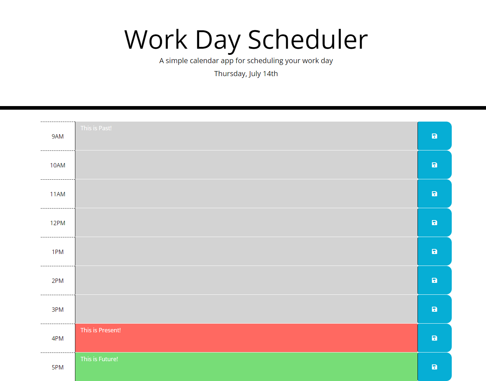
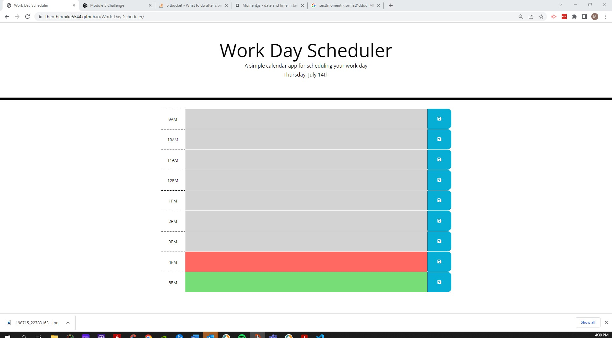

# Work-Day-Scheduler

## Challenge Assessment
This assessment allowed me the opportunity to create a working scheduler utilizing some previous knowledge of HTML, CSS, JavaScript, while implementing Jquery, Bootstrap, and Moment API use. JQuery was utilized in the Script file to greatly shorten my JavaScript code to dynamically create a working application utilizing a base structure format in my Index.HTML. Bootstrap allowed me to apply specific grid-blocking and styling elements to that base HTML structure on the Index.html page. And moment.js was only really used for displaying the date / time / day displays and formatting.

## Use Case
AS AN employee with a busy schedule   
I WANT to add important events to a daily planner   
SO THAT I can manage my time effectively   

## Acceptance Criteria
GIVEN I am using a daily planner to create a schedule   
WHEN I open the planner   
THEN the current day is displayed at the top of the calendar   
WHEN I scroll down   
THEN I am presented with time blocks for standard business hours   
WHEN I view the time blocks for that day   
THEN each time block is color-coded to indicate whether it is in the past, present, or future   
WHEN I click into a time block   
THEN I can enter an event   
WHEN I click the save button for that time block   
THEN the text for that event is saved in local storage   
WHEN I refresh the page   
THEN the saved events persist   

## Screenshot of Application
   
## Screenshot of Live-URL
   
## URL of Deployed Application
https://theothermike5544.github.io/Work-Day-Scheduler/